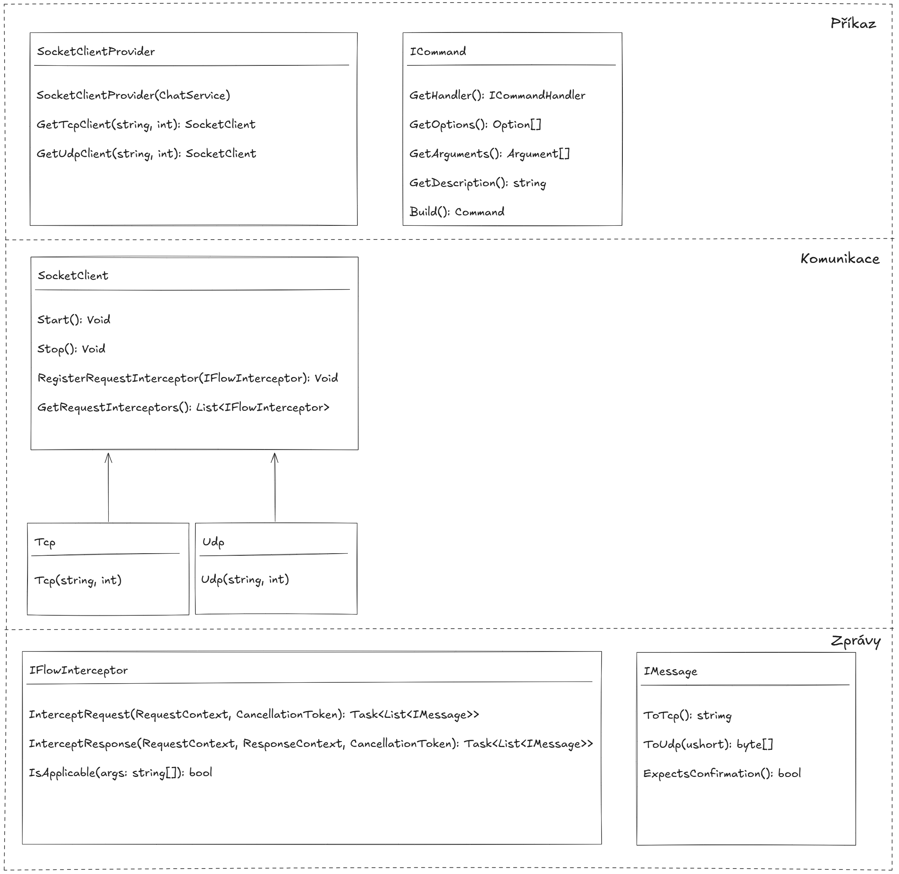

# IPK – 2. Projekt

## Obsah

1. [Souhrn a motivace](#souhrn-a-motivace)
2. [Teorie](#teorie)
3. [Návrh aplikace](#návrh-aplikace)
    - [Architektura a struktura](#architektura-a-struktura)
    - [Výzvy v návrhu](#výzvy-v-návrhu)
    - [Návrh implementace](#návrh-implementace)
4. [Funkcionalita](#funkcionalita)
    - [Funkce programu](#funkce-programu)
5. [Testování](#testování)
    - [Co bylo testováno](#co-bylo-testováno)
    - [Proč bylo testováno](#proč-bylo-testováno)
    - [Jak bylo testováno](#jak-bylo-testováno)
    - [Testovací prostředí](#testovací-prostředí)
    - [Testovací scénáře a výsledky](#testovací-scénáře-a-výsledky)
6. [Spuštění aplikace](#spuštění-aplikace)
7. [Známé chyby / omezení](#známé-chyby--omezení)
8. [Použité zdroje a literatura](#použité-zdroje-a-literatura)
9. [Licence a převzatý kód](#licence-a-převzatý-kód)

---

## Souhrn a motivace

Za úkol bylo vytvořit klientskou aplikaci pro chatový server s využitím stanoveného komunikačního protokolu IPK-25.
Klienti s její pomocí dokáží na takový server připojit, autorizovat a poté komunikovat v textové podobě v připojených
komunikačních kanálech.

## Teorie

Aplikace obsahuje dvě možné varianty komunikace pomocí prokolů TCP nebo UDP. Každý z nich přišel se svou unikátní řádkou
výzev, které bylo třeba řešit. Největší překážkou byla určitě povaha UDP protokolu, po kterém bylo v tomto projektu
vyžadováno, aby jistým způsobem simuloval chování protokolu TCP.

Byl zde využit návrhový vzor klient-server, který je hojně využíván po celém světě nejen pro účely podobné tomuto 
projektu.

Serializace v protokolu TCP je řešena prostým textem, zacož v UDP variantě se zprávy zaobalují do předem dané struktury
bajtů.

## Návrh aplikace

### Architektura a struktura

Projekt je členěn do dvou balíčků IPK_2 a IPK_2.Tests. V této podkapitole se budu věnovat převážně prvnímu zmíněnému.

První záležitostí, kterou bylo třeba řešit, je zpracování příkazů. Pro tento problém byla vytvořena třída `ICommand`,
která slouží pro zjednodušenou práci s příkazy a dovoluje modularizovat příkazový systém a zpracování příkazů.

Co se týče konkrétně zpracování odchozích a příchozích zpráv, je zde navržena třída `IFlowInterceptor`, která má za úkol
převádět psané příkazy do zpráv pro odeslání na server a zpracovávat zprávy přijaté ze serveru. Některé interceptory
obsahují referenci na ChatService, která obsahuje informace o relaci. Mezi informace uložené o relaci patří například,
jestli je relace autorizovaná, jestli se zrovna autorizuje nebo taktéž zobrazované jméno.

### Výzvy v návrhu

Největší výzvou v kódu bylo spojit společnou funkcionalitu správným návrhem, aby byl kód znovupoužitelný skrze obě 
varianty TCP i UDP. Jako řešení jsem vytvořil třídu SocketClient, která spojuje interceptory a zprávy `IMessage`.
IMessage je rozhraní vytvořené pro zavedení znovupoužitelnosti, kdy metody `ToTcp` a `ToUdp` slouží pro převod z modelu
zprávy do serializované formy pro konkrétní protokol. Převod opačným směrem je realizován pomocí dvou statických metod
`FromTcp` a `FromUdp` v rozhraní `IMessage`.

Tento návrh podporuje jak synchronní, tak asynchronní, či paralelní zpracování, takže je více, než vhodný pro tento 
projekt.

### Návrh implementace

Co se týče třídního návrhu a návrhu běhu programu, bylo cílem vytvořit systém přiměřeně modulární pro toto zadání.
Projekt je rozdělen na tři pomyslné "vrstvy".

První vrstvou je **zpracování příkazu CLI**, které se skládá z rozhraní `ICommand`
a spadá do něj také `SocketClientProvider`. Ten je vytvořen implementací `BaseCommand`, která na základě vstupu protokolu
(tcp/udp) volá buď metodu `GetTcpClient` nebo `GetUdpClient`. Ty vrací konkrétní implementaci `SocketClient`, která již
spadá do druhé vrstvy. Druhá vrstva, kterou je **vrstva komunikace**. Tato vrstva má za úkol komunikovat pomocí zvoleného
protokolu se serverem a využívá k tomu třetí vrstvu. Třetí vrstva, nazvěme ji vrstvou zpráv, se stará o zpracování zpráv
v obou směrech. Vytváří a serializuje modely zpráv a provádí logiku jejich zpracování.

## Funkcionalita

### Funkce programu

Program je schopen základních bodů funkcionality, které byly vyžadovány zadáním. Dokáže se připojit na TCP i UDP server,
poté je schopna v rámci stanoveného protokolu uživatele autorizovat, přijmout zprávy serverové i uživatelské, zachycovat
chyby klientské i serverové, odeslat zprávy do zvoleného komunikačního kanálu, změnit komunikační kanál, správně odpovídat
na ping v rámci UDP protokolu a potvrzovat serverové zprávy.

Dále je v jeho rámci zaimplementován příkazový řádek, který nabízí řadu příkazů, které jsou taktéž specifikovány v zadání.
Seznam všech možných příkazů lze vypsat pomocí příkazu /help. V případě, že vstup není příkaz, aplikace na něj nahlíží
jako na zprávu, kterou je třeba zaslat do komunikačního kanálu. To ale pouze v případě, že je uživatel autorizován a je
aktivní relace.

## Testování

### Co bylo testováno

Výčet konkrétních testovaných částí – hlavní funkcionalita + hraniční případy.

### Proč bylo testováno

Vysvětli, proč jsou dané části kritické nebo náchylné k chybám.

### Jak bylo testováno

Metodika – ruční testování, skripty, automatické testy (např. xUnit), scénáře.

### Testovací prostředí

- **Hardware**: Např. notebook s Intel i5, 16 GB RAM
- **Operační systém**: Windows 11 / Ubuntu 22.04
- **Verze .NET SDK**: např. 9.0.100
- **Použité nástroje**: Wireshark, Postman, terminál...

### Testovací scénáře a výsledky

| Scénář | Vstup | Očekávaný výstup | Skutečný výstup | Výsledek |
|--------|-------|------------------|------------------|----------|
| Správný požadavek | `GET localhost:1234` | `200 OK` | `200 OK` | ✅ |
| Timeout serveru | server nedostupný | chyba připojení | chyba připojení | ✅ |
| Chybný vstup | `GETT xyz` | chyba 400 | chyba 400 | ✅ |

**Poznámka:** Výstupy piš textově – žádné screenshoty.

## Spuštění aplikace

Aplikaci lze spustit sestavením pomocí příkazu `make` a následném spuštění zkompilovaného souboru.